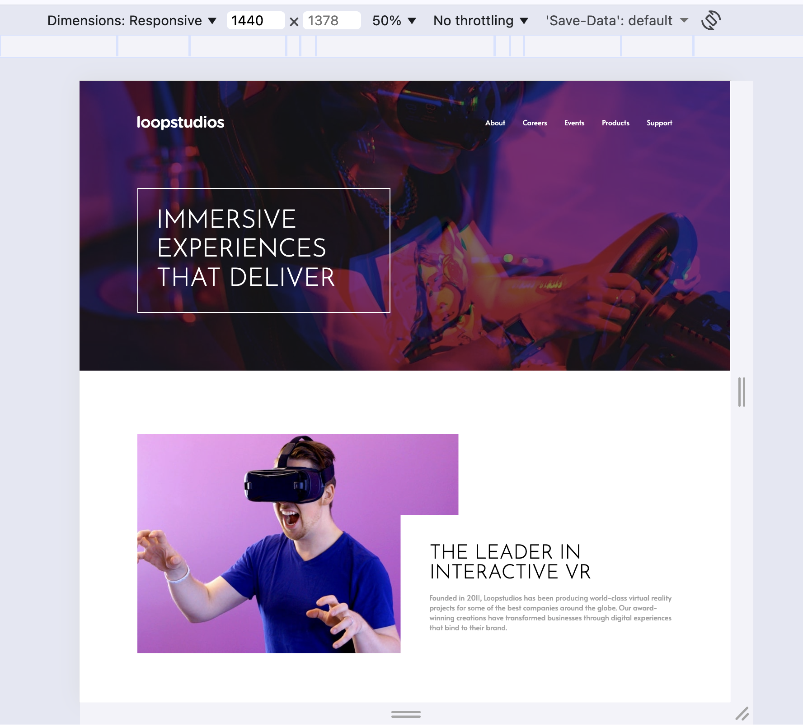
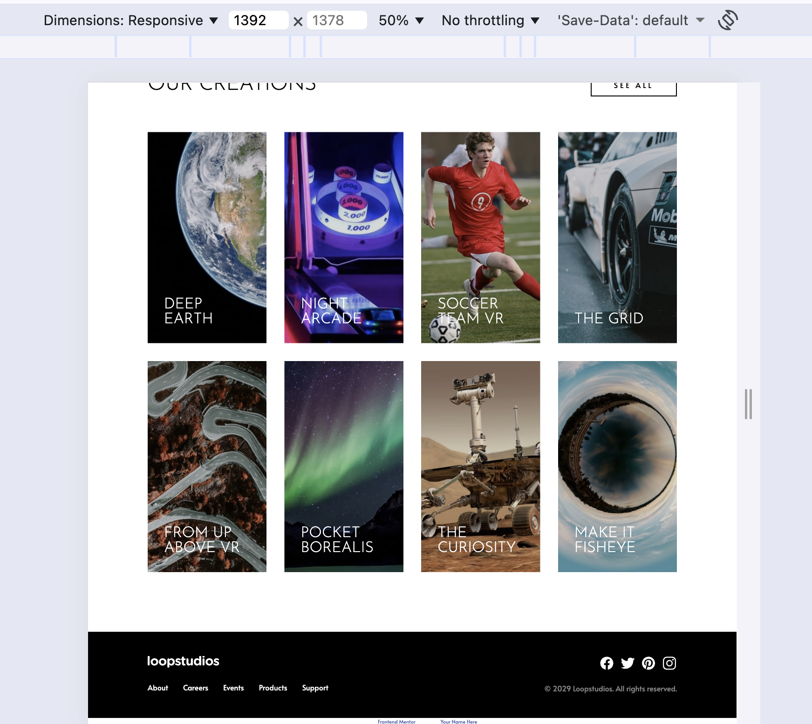
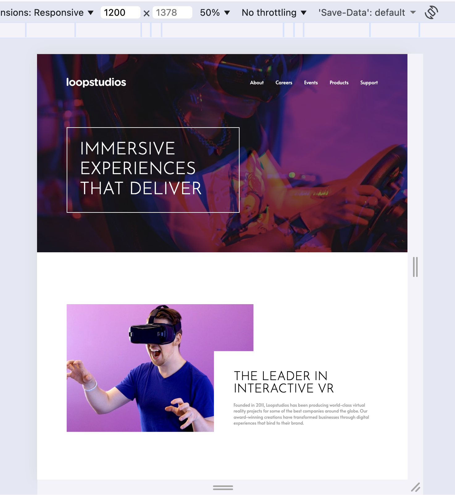
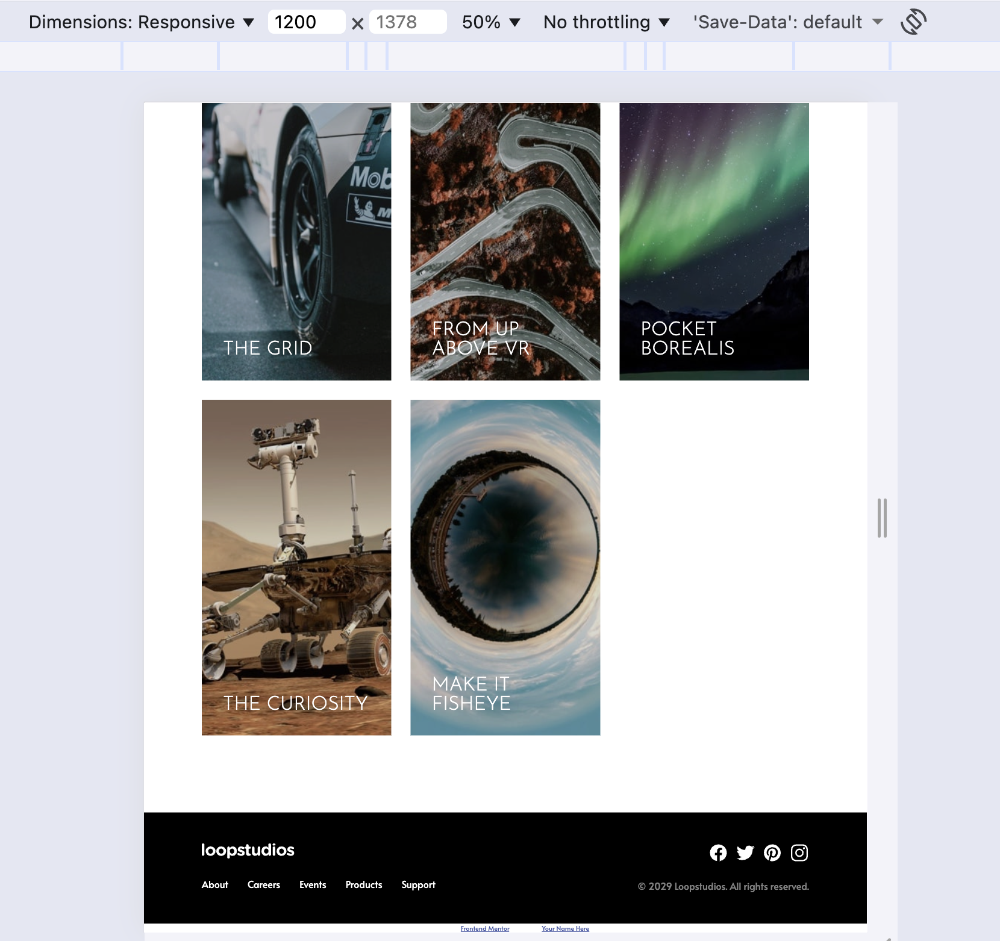
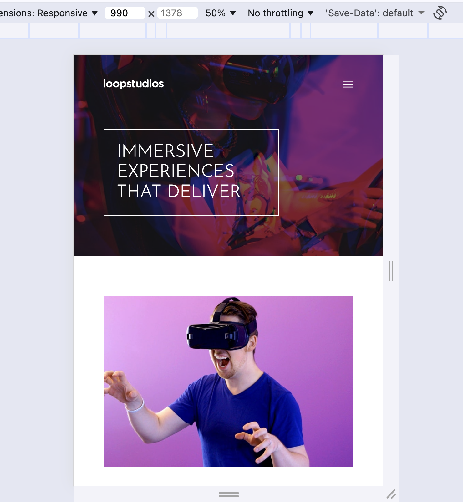
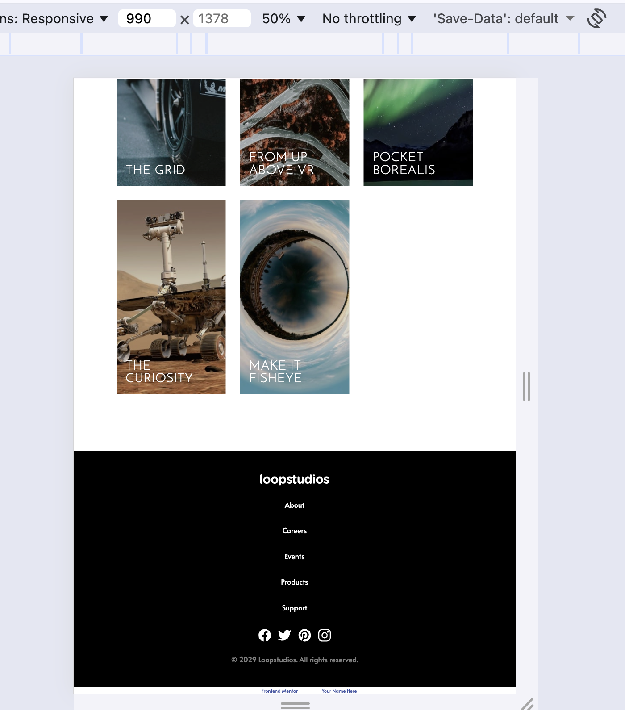
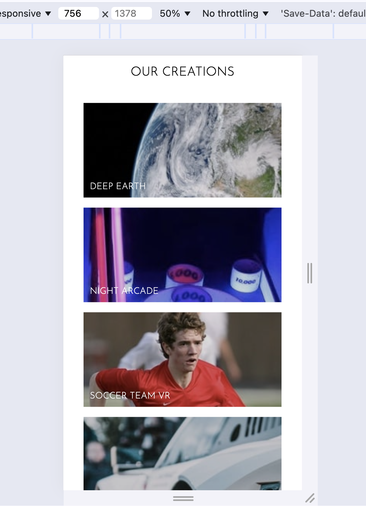
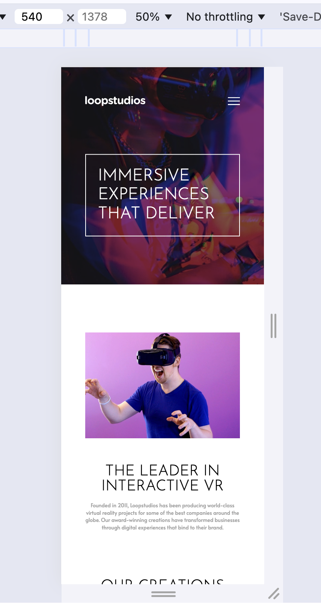
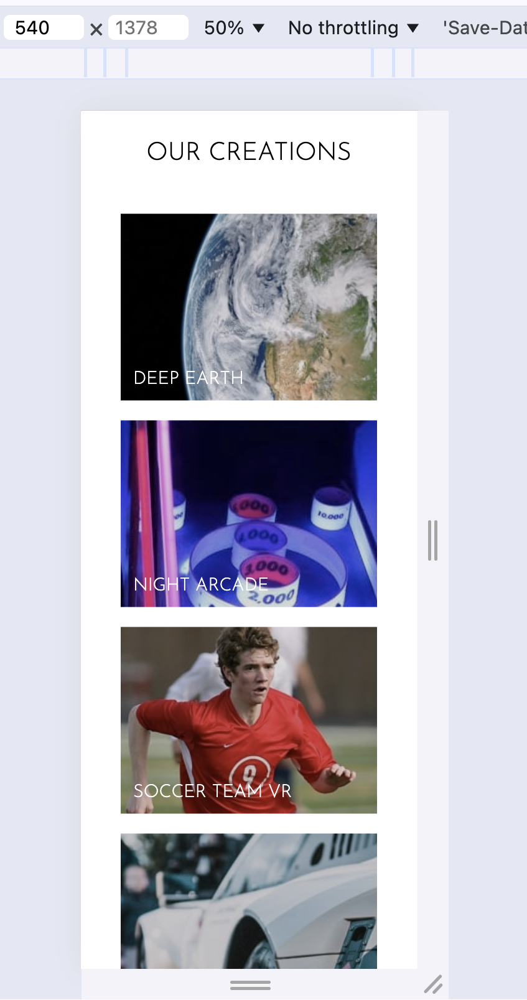
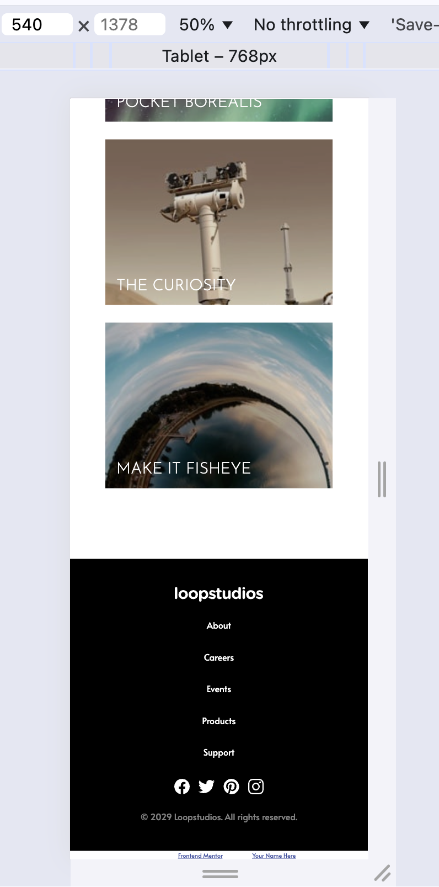

## 📌 Loopstudios Landing Page

A responsive landing page built using HTML and CSS, inspired by the Loopstudios design challenge from Frontend Mentor.

## 🚀 Features

- Fully responsive design (desktop → tablet → mobile)
- Flexbox and CSS Grid layout
- Clean and modern UI
- Hover effects for interactive elements
- Mobile-friendly navigation (hamburger menu support)
- Image overlay and caption effects

## 🛠️ Built With

- HTML5
- CSS3
- Flexbox
- CSS Grid
- Media Queries

## 📂 Project Structure

- /images → All image assets
- index.html → Main HTML file
- style.css → Stylesheet
- README.md → Project documentation

## 📱 Responsive Breakpoints

- 1200px (75rem) → Large screens
- 992px (62rem) → Tablets
- 756px (47.25rem) → Small tablets
- 480px (30rem) → Mobile

## 🎨 Key UI Sections

1. Hero Section

- Background image with overlay (background-blend-mode)
- Navigation bar with hover underline effect
- Large bordered heading

2. About Section

- Grid layout with overlapping text card
- Image + content split layout

3. Our Creations

- CSS Grid gallery (4 → 3 → 1 columns)
- Image hover effects with overlay + brightness change
- Caption transitions

4. Footer

- Sitemap navigation
- Social media icons with hover underline
- Responsive stacking layout

## ✨ Notable CSS Techniques

- background-blend-mode for dark overlay
- ::after pseudo-element for hover underline
- Image brightness filters for hover effects
- Negative margins for overlapping layout
- Mobile-first responsive adjustments

## 📸 Preview

## 📚 Learnings

- Improved understanding of CSS Grid and Flexbox
- Handling responsive layouts using media queries
- Creating interactive hover effects without JavaScript
- Structuring reusable utility classes

## 🔗 Challenge Source

This project is based on the Frontend Mentor challenge:
👉 https://www.frontendmentor.io/challenges/loopstudios-landing-page-N88J5Onjw

## 🙌 Acknowledgements

- Frontend Mentor for the design challenge
- Google Fonts for typography
